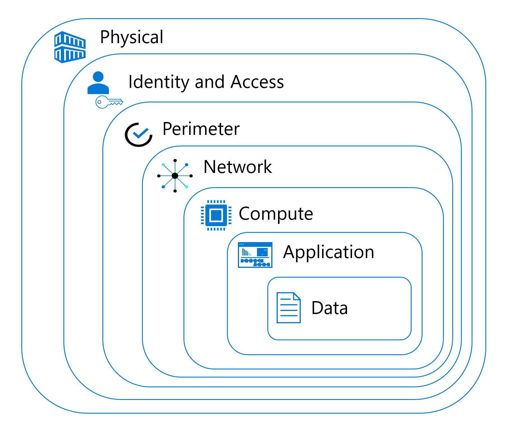
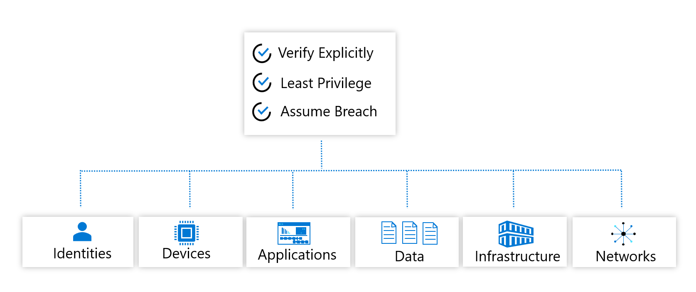

a

# Workshop: SQL Server Security Ground to Cloud

#### <i>A Security Course For Data Professionals</i>

 <h2>01 - Security Landscape</h2>

In <a href="https://github.com/David-Seis/SecureYourAzureData" target="_blank">this workshop</a> you'll cover the basics of securing SQL Server installations and databases, from on-premises systems to Microsoft Azure deployments.

In each module you'll get more references, which you should follow up on to learn more. Also watch for links within the text - click on each one to explore that topic.

(<a href="https://github.com/David-Seis/SecureYourAzureData/blob/main/SQLSecurity/00%20-%20Pre-Requisites.md" target="_blank">Make sure you check out the <b>Pre-Requisites</b> page before you start</a>. You'll need all of the items loaded there before you can proceed with the workshop.)

You'll cover these topics in this Module:
<dl>
  <dt><a href="#01" target="_blank"><dt>01 - Computing Security</dt></a>
  <dt><a href="#02" target="_blank"><dt>02 - Database Components of Commputing Security</dt></a>
</dl>

<h2 id="01">1.0 Computing Security</h2>
The Data Professional is not entirely responsible for the security of the entire organization, but they do need to be aware of the various components within computing security, and how the database figures into those components.

This section covers the basics of Computing Security - defined as "allowing the right people to access the right objects in the right way and in the right situations". That also means preventing unauthorized persons from accessing objects they do not have permissions for.

> The "References" section that follows has much more detail on this topic.

<h5>Identity, Access and Authentication</h5>

<h3>1.1 Computing Security Paradigms</h3>
Computing Security paradigms are a kind of framework or action paths you can use to form the basis of good security policies and practices in your organization. These paradigms and frameworks allow each part of the organization to understand their responsibilities for security.

<h4>1.1.1 Defense in Depth</h4>
One of the oldest security paradigms is *Defense in Depth*. You check and secure each area along a path from the physical access to the computing assets all the way through to the data objects.

 

**Physical security**: Restricting and controlling access to your datacenteror computing assets to only allow authorized personnel.
**Identity and access security controls**: Using multifactor authentication and conditional  access for infrastructure, code, and change tracking systems.
**Perimeter security**:  Creating defenses at the network level for distributed denial of service (DDoS) attacks.
**Network security** Using network access controls and segmentation to limit communication between systems, avoiding spoofing, man-in-the-middle attacks, and other network-related issues.
**Compute layer security**: Creating a strong system for controlloing access to physical and virtual machines, and implementing string Cloud Controls.
**Application layer security**: Implementing Secure Code practices and policies to prevent security vulnerabilities. An ogoing process.
**Data layer security**: Ensuring that business and customer data is encrypted and protected against unwanted access at rest, in=-transit, in-memory and in-code processes. This is the focus of this course. 

<h4>1.1.2 Zero Trust</h4> 

The "Zero Trust" paradigm is a modern framework for distributed applications where you cannot control the various networks and access points applications may use. It layers three basic concepts, Verify Explicitly, Least Privilege, and Assume Breach, over multiple objects in your system:

- Identities
- Devices
- Applications
- Data
- Infrastructure
- Networks

 

**Verify Explicitly**: Authenticate and authorize based on the available data points, including user identity, location, device, service or workload, data classification, and anomalies.
**Least Privilege**: Limit user access with just-in-time and just-enough access (JIT/JEA), risk-based adaptive policies, and data protection to protect both data and productivity.
**Assume Breach**: Segment access by network, user, devices, and application. Use encryption to protect data, and use analytics to get visibility, detect threats, and improve your security.

 

<b>Activity: TODO: Activity Name</b>

TODO: Activity Description and tasks

<b>Description</b>

TODO: Enter activity description with checkbox

<b>Steps</b>

TODO: Enter activity steps description with checkbox

<h2 id="02">2.0 Database Components of Computing Security</h2>

 

<h3>Database Security or Application Security</h3>
 

<h3>Role-Based Access Control (RBAC)</h3>
 

<b>Activity: TODO: Activity Name</b>

TODO: Activity Description and tasks

<b>Description</b>

TODO: Enter activity description with checkbox

<b>Steps</b>

TODO: Enter activity steps description with checkbox

 

<b>For Further Study</b>

<ul>
    <li><a href="https://docs.microsoft.com/en-us/sql/database-engine/install-windows/install-sql-server?view=sql-server-ver16" target="_blank">Official Documentation for this section</a></li>
</ul>

<b >Next Steps</b>

Next, Continue to <a href="[url](https://github.com/David-Seis/SecureYourAzureData/blob/Buck/SQLSecurity/01%20-%20SecurityLandscape.md)" target="_blank"><i> 01 - The Database Security Landscape</i></a>.