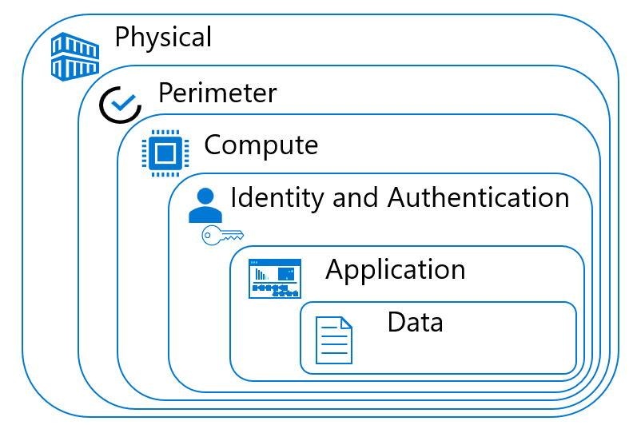

# Workshop: SQL Server Security Ground to Cloud

#### <i>A Security Course For Data Professionals</i>

 <h2>01 - Security Landscape</h2>

In <a href="https://github.com/David-Seis/SecureYourAzureData" target="_blank">this workshop</a> you'll cover the basics of securing SQL Server installations and databases, from on-premises systems to Microsoft Azure deployments.

In each module you'll get more references, which you should follow up on to learn more. Also watch for links within the text - click on each one to explore that topic.

(<a href="https://github.com/David-Seis/SecureYourAzureData/blob/main/SQLSecurity/00%20-%20Pre-Requisites.md" target="_blank">Make sure you check out the <b>Pre-Requisites</b> page before you start</a>. You'll need all of the items loaded there before you can proceed with the workshop.)

In this module you will learn the general Information Technology security landscape, and the role of the data professional in that area. While you may not be responsible for the entire organization's security posture, you should be familiar with where the data storage and processing security part of that larger security footprint.

You'll cover these topics in this Module:
<dl>
  <dt><a href="#01" target="_blank"><dt>01 - Computing Security</dt></a>
  <dt><a href="#02" target="_blank"><dt>02 - Database Components of Commputing Security</dt></a>
</dl>

<h2 id="01">1.0 Computing Security</h2>
The Data Professional is not entirely responsible for the security of the entire organization, but they do need to be aware of the various components within computing security, and how the database figures into those components.

This section covers the basics of computing security - defined as "allowing the right people to access the right objects in the right way and in the right situations". That also means preventing unauthorized persons from accessing objects they do not have permissions for. In the sections that follow, you will learn more about the entire Computing Security landscape, and how and where database security fits into that landscape.

> The "References" section that follows has much more detail on this topic.

<h5>Identity, Authentication and Authorization</h5>

Computing Security paradigms are a kind of framework or action paths you can use to form the basis of good security policies and practices in your organization. These paradigms and frameworks allow each part of the organization to understand their responsibilities for security. It involves three main areas:
- Identity: The user or process that is requesting access to an asset
- Athentication: A system or systems that prove the Indentity
- Authorization: The permissions granted or denied on an asset to the identity

<h3>1.1 Computing Security Paradigms</h3>
To adequately secure a resource, security processes and programs within operating systems and applications control each area. You can implement those areas using various methods and processes, and over time various frameworks for tracking Identity, Authentication and Authorization have been created. Two of these are <b>Defense in Depth</b>, and <b>Zero Trust</b>.

<h4>1.1.1 Defense in Depth</h4>
  One of the oldest security paradigms is <b>Defense in Depth</b>. You check and secure each area along a path from the physical access to the computing assets all the way through to the data objects. There are specific steps and actions 

 

- **Physical**: Involves restricting and <a href="https://docs.microsoft.com/en-us/windows-server/identity/ad-ds/plan/security-best-practices/securing-domain-controllers-against-attack" target="_blank">controlling access to your datacenter and computing assets</a> to only allow authorized access.
- **Perimeter**:  Entails creating defenses at the network level for <a href="https://docs.microsoft.com/en-us/azure/ddos-protection/types-of-attacks" target="_blank">distributed denial of service (DDoS)</a> attacks, and using <a href="https://docs.microsoft.com/en-us/azure/azure-sql/database/network-access-controls-overview?view=azuresql" target="_blank">network access controls</a>, <a href="https://docs.microsoft.com/en-us/azure/virtual-network/network-security-groups-overview" target="_blank">Network Security Groups</a>, and other network segmentation strategies to limit communication between systems, avoiding spoofing, man-in-the-middle attacks, and other network-related issues.
- **Compute**: Requires creating a <a href="https://techcommunity.microsoft.com/t5/itops-talk-blog/introduction-to-secured-core-computing/ba-p/2701672" target="_blank">strong system</a> for controlling access to physical and virtual machines, and implementing strong Cloud controls.
- **Identity and Authorization**: Defining Principals and checking that they are who they claim using <a href="https://docs.microsoft.com/en-us/azure/active-directory/authentication/concept-mfa-howitworks" target="_blank">multifactor authentication</a> and other conditional access systems for infrastructure, code, and change tracking systems.
- **Application**: Implementing <a href="https://docs.microsoft.com/en-us/dotnet/standard/security/secure-coding-guidelines" target="_blank">Secure Code</a> practices and policies to prevent security vulnerabilities.
- **Data**: Ensuring that business and customer data is encrypted and protected against unwanted access at rest, in=-transit, in-memory and in-code processes. This is the focus of this course.

<h4>1.1.2 Zero Trust</h4> 

  The <b>Zero Trust</b> paradigm is a modern framework for distributed applications where you cannot control the various networks and access points applications may use. It layers three basic concepts, Verify Explicitly, Least Privilege, and Assume Breach, over multiple objects in your system:

- Identities
- Devices
- Applications
- Data
- Infrastructure
- Networks

 

- **Verify Explicitly**: Authenticate and authorize based on the available data points, including user identity, location, device, service or workload, data classification, and anomalies.
- **Least Privilege**: Limit user access with just-in-time and just-enough access (JIT/JEA), risk-based adaptive policies, and data protection to protect both data and productivity.
- **Assume Breach**: Segment access by network, user, devices, and application. Use encryption to protect data, and use analytics to get visibility, detect threats, and improve your security.

 

<b>Activity: Review Defense in Depth and Zero Trust Paradigms</b>

In this exercise you will review two videos on Defense in Depth and Zero Trust concepts.

> If you are taking this workshop in-person, your instructor may direct you to watch these videos later if there are time constraints.

<b>Steps</b>

- <a href="https://docs.microsoft.com/en-us/shows/azure-videos/defense-in-depth-security-in-azure" target="_blank">Right-click and open this reference in a separate browser tab and watch the video you see there on "Defense in depth".</a>.
- <a href="https://docs.microsoft.com/en-us/shows/azure-videos/take-a-zero-trust-approach-to-secure-your-networks" target="_blank">Right-click and open this reference in a separate browser tab and watch the video you see there on "Zero Trust".</a>.

<h2 id="02"> 2.0 Database Components of Computing Security</h2>
Your role for security as the Data Professional involves being a part of the complete security landscape in your organization. This requires coordination and standardization of all teams involved in Information Technology. 

At the end of this course, you'll find a basic Data Security Checklist template, that you can use as a starting point for developing your own standards.

> In the Modules that follow, you'll learn more about the details of each of these concepts, and have specific Activities to experiment with them. 

<h3>Database Security Process</h3>
There are various steps you can take for starting the process to secure your database platform, whether that is a full Instance of SQL Server or an Azure SQL DB database. In Module 2, you will focus on an Instance of SQL Server installed on a physical computer, or in a Virtual Machine. In Module 3,  you will extend this process to the Microsoft Azure SQL Platform. 

<h4>SQL Server Instance</h4>
Beyond the phsysical facilities and access to the environment where your SQL Server hardware is located, you must also set up system access and file protections. SQL Server uses multiple files, which have various file locations depending on their purpose. Use <a href="https://docs.microsoft.com/en-us/sql/sql-server/install/file-locations-for-default-and-named-instances-of-sql-server?view=sql-server-ver16">this reference to understand those locations and create your "Data at Rest" strategy and protections</a>.

<h3>Determine Access Strategy</h3>

After you secure the SQL Server Instance platform and configuration, and you've set in place your security at-rest strategy, it's time to evaluate the application access for each data set. In general, there are five primary methods of access: 

 

Other combinations of access are possible, and you can derive the proper security posture those applications use from the basic patterns described here.

- SQL Server Authentication
SQL Server allows for a self-contained security mechanism. The name/password pairs for Instance Logons and Database Users are stored directly in tables in the *master* and the specific database, and these are mapped to each other. 

- Integrated Authentication
SQL Server can also use <a href="https://docs.microsoft.com/en-us/sql/linux/sql-server-linux-ad-auth-understanding?view=sql-server-ver16">Active Directory to allow access to database objects</a>. SQL Server also allows for "Contained" databases, where the Database Users are not mapped to an Instance Logon. You will explore these options in the Modules that follow.
Microsoft Azure SQL DB allows SQL Server authenticated users, as well as Azure Active Directory authentication, in addition to Role-Base Access Conrol (RBAC) and also <a href="https://docs.microsoft.com/en-us/sql/relational-databases/security/contained-database-users-making-your-database-portable?view=azuresqldb-current">Contained users (a best-practice)</a> which you will learn more about shortly. 

- Certificate and other non-user methods of Authentication
Certificates are not used to log in to a SQL Server Instance or Database, <a href="https://docs.microsoft.com/en-us/sql/relational-databases/security/sql-server-certificates-and-asymmetric-keys?view=sql-server-ver16">but are used to help secure connections, for database mirroring connections, to sign packages and other objects, or to encrypt data and connections</a>.

- Application Proxy
In this pattern the database stores user and permission information in it's own storage, and the application accesses the database on behalf of all users, performing operations on their behalf. The application has access to all data and objects, and the users have none. 

- Application Roles
An application role is a SQL Server Database principal with user-like permissions. You  use application roles to enable access to specific data to only those users who connect through a an  application. Application Roles do not have members. A user logs in to the application, the application logs into SQL Server, and then assigns permissions to objects using the application role. The user has no permissions other than that which the application provides through the role.  

<b>Activity: General SQL Server Instance Security Settings Review</b>

In this Activity you will use the SQL Server Configuration Manager tool and the SQL Server Management Studio tool to review the settings that deal with security for your installation.

<b>Steps</b>

Check Networks and other settings in Configuration Manager

- Using the Windows Start Menu on your test system, search for "SQL Server Configuration Manager" and run it. 
- Evaluate each section to see the network protocols and ports that are opened, the Account running each service, and the status of each Service it controls.

Check Instance Configuration using SQL Server Management Studio

  - Using the Windows <b>Start Menu</b> on your test system, search for "SQL Server Configuration Manager" and run it.
- On the left-hand side, in the Object Explorer, right-click the name of your test Instance and select "Properties". 
- Evaluate each section, paying special attention to the primary Authentication methods, the file locations, and other security and authorization settings.
- You can <a href="https://docs.microsoft.com/en-us/sql/database-engine/configure-windows/view-or-change-server-properties-sql-server?view=sql-server-ver16" target="_blank">learn more about the Server Properties panel, along with various Transact-SQL statements you can use to discover more about your Instance here</a>.

Run Standard Reports for Security using SQL Server Management Studio

- Double-click your Instance, double-click <b>Security</b>, and right-click <b>Logins</b>. 
- Click <b>Reports</b>, then <b>Standard Reports</b>, and run all of the reports you see there. 

 

<b>Activity: Azure SQL Database Security Settings Review</b>

In this Activity you will use the SQL Server Configuration Manager tool and the SQL Server Management Studio tool to review the settings that deal with security for your installation.

<b>Steps</b>

Use the Azure Portal to review your security settings

- Open the Azure Portal for your account, navigate to the Resource Group for your Azure SQL DB created for this course, and click the <b>Security</b> item on the left-side of the database blade. Review each setting in light of the guide you opened in the previous step.

 

<b>Activity: Microsoft Defender for SQL Security Score</b>

In this Activity you will review the process to create a "Security Score" using Microsoft Azure Defender. 

<b>Steps</b>

  - Open <a href="https://docs.microsoft.com/en-us/microsoft-365/security/defender/microsoft-secure-score?view=o365-worldwide" target="_blank">this reference, and review the video</a> you see near the top of the page. If there is time in the course, you can follow those instructions to run the evaluation.
  

 

<b>For Further Study</b>

<ul>
    <li><a href="https://docs.microsoft.com/en-us/security/ciso-workshop/the-ciso-workshop" target="_blank">You can find a Chief Information Security Office (CISO) workshop to accelerate your security program modernization with reference strategies built using Zero Trust principles here</a></li>
    <li><a href="https://docs.microsoft.com/en-us/sql/relational-databases/security/security-center-for-sql-server-database-engine-and-azure-sql-database?view=sql-server-ver16" target="_blank">Official Documentation for SQL Server Security</a></li>
    <li><a href="https://docs.microsoft.com/en-us/sql/relational-databases/security/security-center-for-sql-server-database-engine-and-azure-sql-database?view=azuresqldb-current" target="_blank">Official Documentation for Azure SQL DB Security</a></li>
</ul>

<b >Next Steps</b>

Next, Continue to <a href="https://github.com/David-Seis/SecureYourAzureData/blob/main/SQLSecurity/02%20-%20SQLServerSecurityBasics.md" target="_blank"><i> 02 - SQL Server Security</i></a>.
